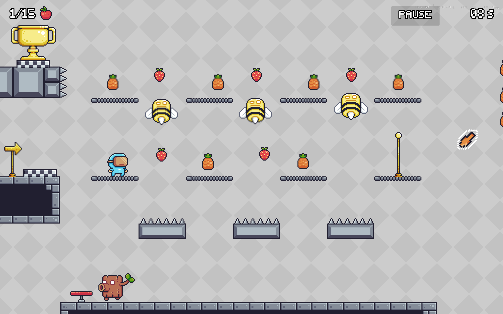
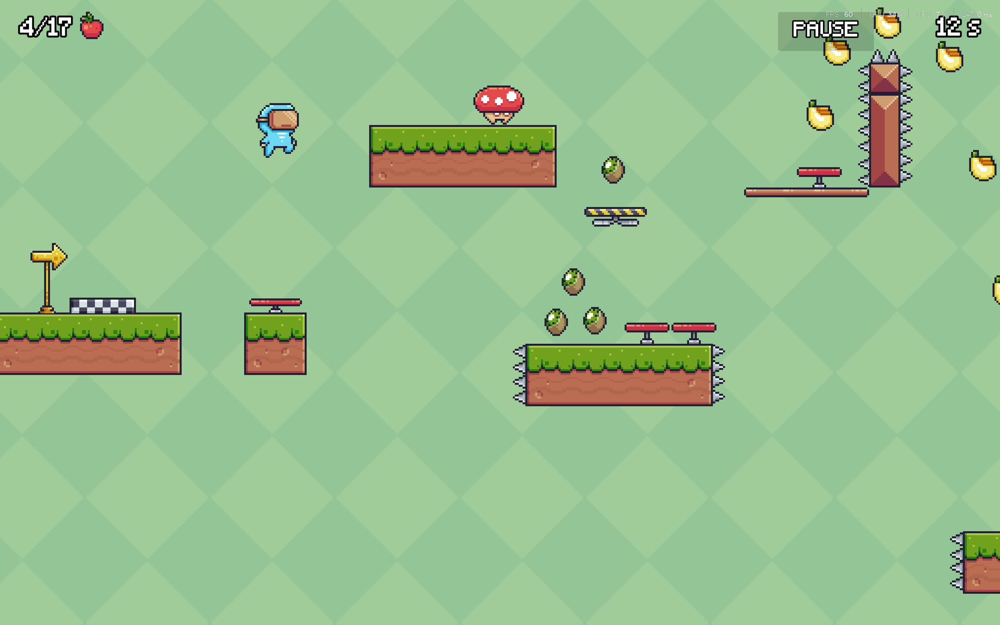
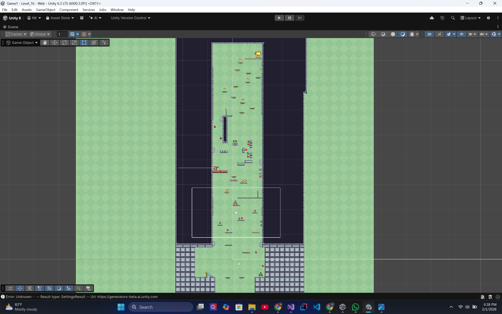
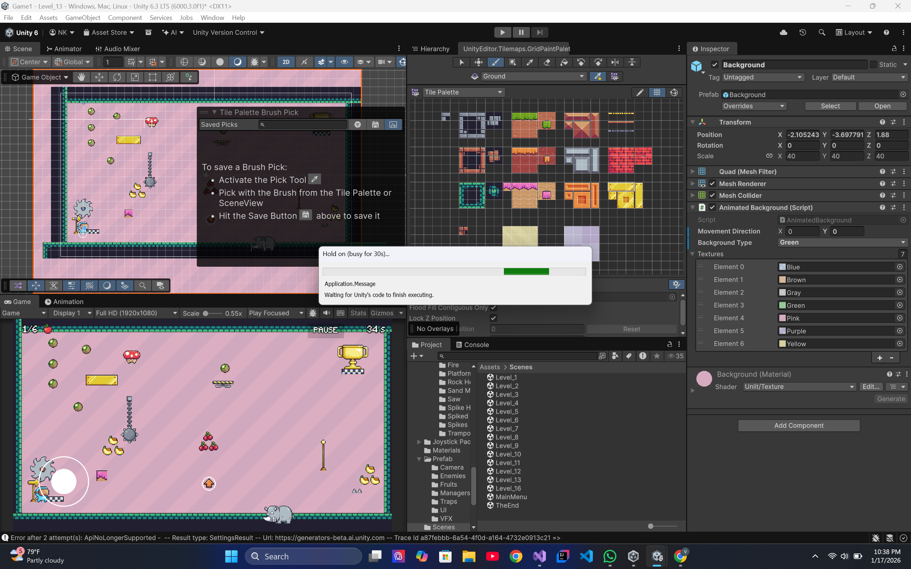

# 🎮 2D Platformer Game (Unity)

A complete **2D pixel-art platformer game** developed using **Unity**, featuring handcrafted levels, enemies, traps, collectibles, and a polished UI system.

The game is built and released for **Web, Windows, and Android**, with the web version published on **itch.io**.

  

---

## 🚀 Play the Game

- 🌐 **Web (itch.io):** https://nadil-hesara.itch.io/platformer  
- 🖥️ **Windows Build:** Available in the `Windows Build/` folder  
- 📱 **Android Build:** Available in the `Android Build/` folder  

---

## 🧩 Gameplay Preview

  
  

Fast-paced platforming with precise jumps, trampolines, collectibles, and hazards designed to test timing and control.

---

## 👾 Enemies & Traps

  

- Multiple enemy types with different behaviors  
- Traps including spikes, saws, falling platforms, and trampolines  
- Risk-reward gameplay using collectibles and hazards  

---

## 🗺️ Level Design

  

- Handcrafted levels with progressive difficulty  
- Designed around movement mastery and timing  
- Visual clarity with pixel-art aesthetics  

---

## 🛠️ Development (Unity)

  

This project was developed fully in **Unity**, covering gameplay logic, UI systems, enemy AI, level construction, and deployment pipelines.

---

## ✨ Key Features

- Smooth player movement & jumping mechanics
- Enemy AI and hazard systems
- Collectibles and scoring logic
- Trampoline & physics-based gameplay elements
- Pause menu & in-game UI
- Scene transitions and game flow
- Cross-platform builds (WebGL, Windows, Android)

---

## 🧰 Built With

- **Engine:** Unity  
- **Language:** C#  
- **Assets:** Pixel-art game assets  
- **Platforms:** WebGL, Windows, Android  

---

## 🎓 Learning Outcomes

This project provided hands-on experience in:

- Unity game architecture & scripting
- Player physics and collision systems
- Enemy AI & trap mechanics
- Level design and balancing
- UI systems and state management
- Cross-platform builds and deployment
- Completing and publishing a full game project

---

## 👤 Author

**Nadil Hesara**  
- GitHub: https://github.com/nadilHesara  
- itch.io: https://nadil-hesara.itch.io/platformer  

---

⭐ If you like the project, feel free to star the repository!

